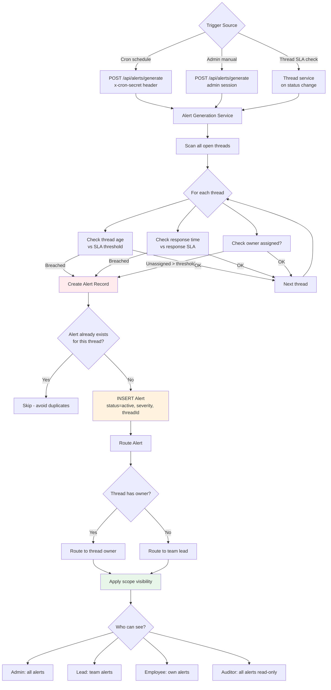
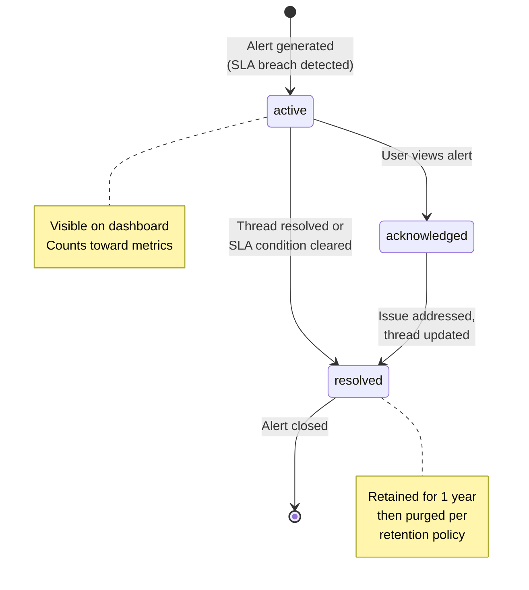
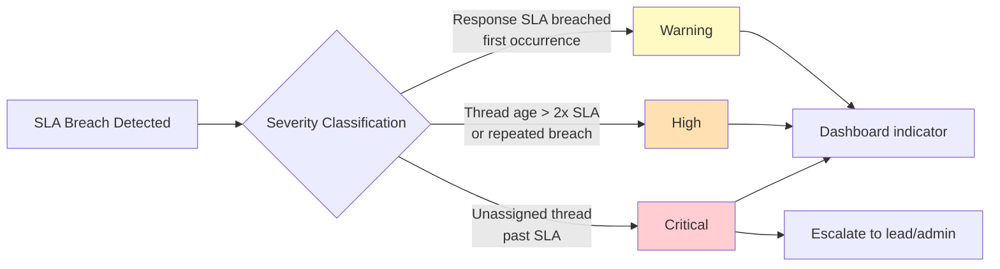

# Alert Generation and Routing

```mermaid
flowchart TD
    TRIGGER{Trigger Source} -->|Cron schedule| CRON[POST /api/alerts/generate<br/>x-cron-secret header]
    TRIGGER -->|Admin manual| ADMIN[POST /api/alerts/generate<br/>admin session]
    TRIGGER -->|Thread SLA check| SLA[Thread service<br/>on status change]

    CRON --> GEN[Alert Generation Service]
    ADMIN --> GEN
    SLA --> GEN

    GEN --> SCAN[Scan all open threads]
    SCAN --> CHECK{For each thread}

    CHECK --> AGE[Check thread age<br/>vs SLA threshold]
    CHECK --> RESP[Check response time<br/>vs response SLA]
    CHECK --> OWNER[Check owner assigned?]

    AGE -->|Breached| ALERT
    RESP -->|Breached| ALERT
    OWNER -->|Unassigned > threshold| ALERT
    AGE -->|OK| NEXT[Next thread]
    RESP -->|OK| NEXT
    OWNER -->|OK| NEXT
    NEXT --> CHECK

    ALERT[Create Alert Record] --> DEDUP{Alert already exists<br/>for this thread?}
    DEDUP -->|Yes| SKIP[Skip - avoid duplicates]
    DEDUP -->|No| PERSIST[INSERT Alert<br/>status=active, severity, threadId]

    PERSIST --> ROUTE[Route Alert]

    ROUTE --> R1{Thread has owner?}
    R1 -->|Yes| NOTIFY_OWNER[Route to thread owner]
    R1 -->|No| NOTIFY_LEAD[Route to team lead]

    NOTIFY_OWNER --> SCOPE[Apply scope visibility]
    NOTIFY_LEAD --> SCOPE

    SCOPE --> VIS{Who can see?}
    VIS --> V1[Admin: all alerts]
    VIS --> V2[Lead: team alerts]
    VIS --> V3[Employee: own alerts]
    VIS --> V4[Auditor: all alerts read-only]

    style ALERT fill:#ffebee
    style PERSIST fill:#fff3e0
    style SCOPE fill:#e8f5e9
```

## Alert Lifecycle

```mermaid
stateDiagram-v2
    [*] --> active: Alert generated<br/>(SLA breach detected)

    active --> acknowledged: User views alert
    active --> resolved: Thread resolved or<br/>SLA condition cleared

    acknowledged --> resolved: Issue addressed,<br/>thread updated

    resolved --> [*]: Alert closed

    note right of active: Visible on dashboard<br/>Counts toward metrics
    note right of resolved: Retained for 1 year<br/>then purged per<br/>retention policy
```

## Alert Severity

```mermaid
flowchart LR
    BREACH[SLA Breach Detected] --> SEV{Severity Classification}

    SEV -->|Response SLA breached<br/>first occurrence| WARN[Warning]
    SEV -->|Thread age > 2x SLA<br/>or repeated breach| HIGH[High]
    SEV -->|Unassigned thread<br/>past SLA| CRIT[Critical]

    WARN --> DASH[Dashboard indicator]
    HIGH --> DASH
    CRIT --> DASH
    CRIT --> ESC[Escalate to lead/admin]

    style WARN fill:#fff9c4
    style HIGH fill:#ffe0b2
    style CRIT fill:#ffcdd2
```
