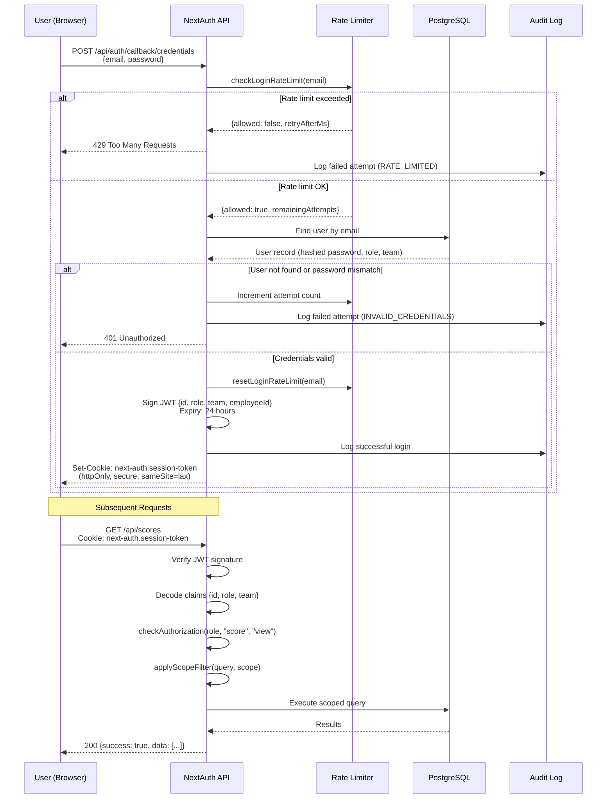

# Login / Session Flow

```mermaid
sequenceDiagram
    participant U as User (Browser)
    participant N as NextAuth API
    participant RL as Rate Limiter
    participant DB as PostgreSQL
    participant AL as Audit Log

    U->>N: POST /api/auth/callback/credentials<br/>{email, password}
    N->>RL: checkLoginRateLimit(email)

    alt Rate limit exceeded
        RL-->>N: {allowed: false, retryAfterMs}
        N-->>U: 429 Too Many Requests
        N->>AL: Log failed attempt (RATE_LIMITED)
    else Rate limit OK
        RL-->>N: {allowed: true, remainingAttempts}
        N->>DB: Find user by email
        DB-->>N: User record (hashed password, role, team)

        alt User not found or password mismatch
            N->>RL: Increment attempt count
            N->>AL: Log failed attempt (INVALID_CREDENTIALS)
            N-->>U: 401 Unauthorized
        else Credentials valid
            N->>RL: resetLoginRateLimit(email)
            N->>N: Sign JWT {id, role, team, employeeId}<br/>Expiry: 24 hours
            N->>AL: Log successful login
            N-->>U: Set-Cookie: next-auth.session-token<br/>(httpOnly, secure, sameSite=lax)
        end
    end

    Note over U,N: Subsequent Requests

    U->>N: GET /api/scores<br/>Cookie: next-auth.session-token
    N->>N: Verify JWT signature
    N->>N: Decode claims {id, role, team}
    N->>N: checkAuthorization(role, "score", "view")
    N->>N: applyScopeFilter(query, scope)
    N->>DB: Execute scoped query
    DB-->>N: Results
    N-->>U: 200 {success: true, data: [...]}
```
