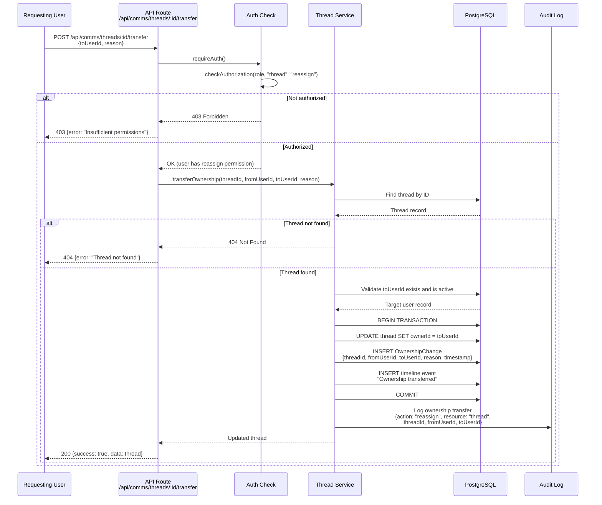
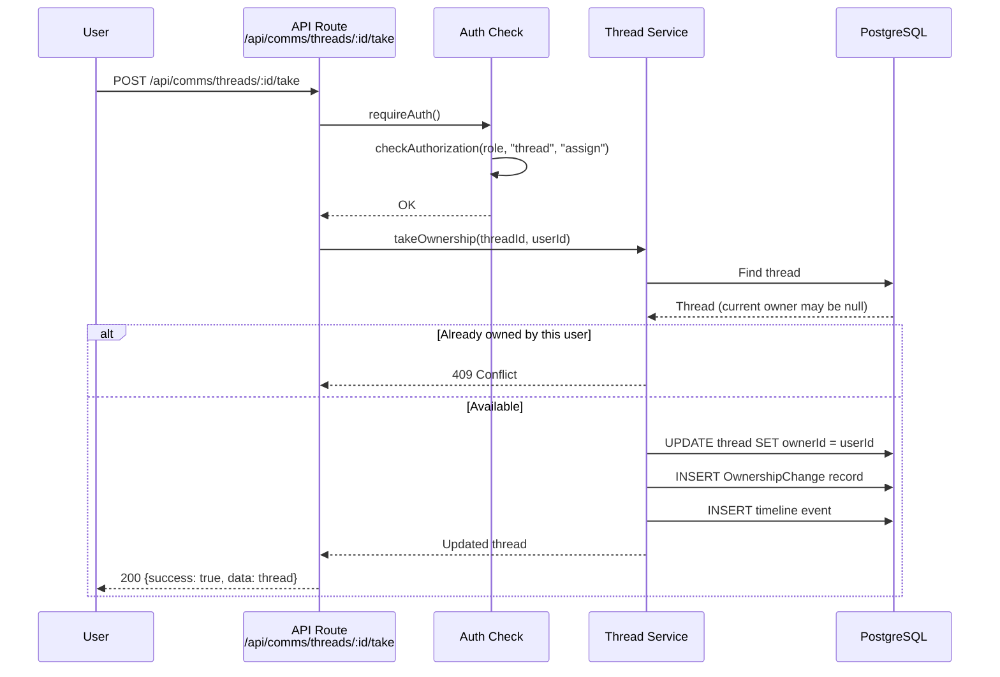
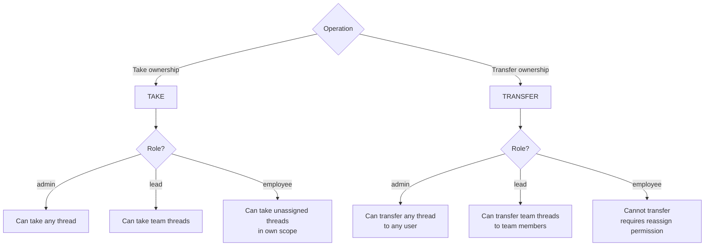

# Ownership Transfer Workflow

```mermaid
sequenceDiagram
    participant U as Requesting User
    participant API as API Route<br/>/api/comms/threads/:id/transfer
    participant Auth as Auth Check
    participant TS as Thread Service
    participant DB as PostgreSQL
    participant AL as Audit Log

    U->>API: POST /api/comms/threads/:id/transfer<br/>{toUserId, reason}
    API->>Auth: requireAuth()
    Auth->>Auth: checkAuthorization(role, "thread", "reassign")

    alt Not authorized
        Auth-->>API: 403 Forbidden
        API-->>U: 403 {error: "Insufficient permissions"}
    else Authorized
        Auth-->>API: OK (user has reassign permission)
        API->>TS: transferOwnership(threadId, fromUserId, toUserId, reason)

        TS->>DB: Find thread by ID
        DB-->>TS: Thread record

        alt Thread not found
            TS-->>API: 404 Not Found
            API-->>U: 404 {error: "Thread not found"}
        else Thread found
            TS->>DB: Validate toUserId exists and is active
            DB-->>TS: Target user record

            TS->>DB: BEGIN TRANSACTION
            TS->>DB: UPDATE thread SET ownerId = toUserId
            TS->>DB: INSERT OwnershipChange<br/>{threadId, fromUserId, toUserId, reason, timestamp}
            TS->>DB: INSERT timeline event<br/>"Ownership transferred"
            TS->>DB: COMMIT

            TS->>AL: Log ownership transfer<br/>{action: "reassign", resource: "thread",<br/>threadId, fromUserId, toUserId}

            TS-->>API: Updated thread
            API-->>U: 200 {success: true, data: thread}
        end
    end
```

## Take Ownership (Self-assign)

```mermaid
sequenceDiagram
    participant U as User
    participant API as API Route<br/>/api/comms/threads/:id/take
    participant Auth as Auth Check
    participant TS as Thread Service
    participant DB as PostgreSQL

    U->>API: POST /api/comms/threads/:id/take
    API->>Auth: requireAuth()
    Auth->>Auth: checkAuthorization(role, "thread", "assign")

    Auth-->>API: OK
    API->>TS: takeOwnership(threadId, userId)

    TS->>DB: Find thread
    DB-->>TS: Thread (current owner may be null)

    alt Already owned by this user
        TS-->>API: 409 Conflict
    else Available
        TS->>DB: UPDATE thread SET ownerId = userId
        TS->>DB: INSERT OwnershipChange record
        TS->>DB: INSERT timeline event
        TS-->>API: Updated thread
        API-->>U: 200 {success: true, data: thread}
    end
```

## Permission Matrix for Ownership Operations

```mermaid
flowchart TD
    OP{Operation} -->|Take ownership| TAKE
    OP -->|Transfer ownership| TRANSFER

    TAKE --> TA{Role?}
    TA -->|admin| TA_ALL[Can take any thread]
    TA -->|lead| TA_TEAM[Can take team threads]
    TA -->|employee| TA_OWN[Can take unassigned threads<br/>in own scope]

    TRANSFER --> TR{Role?}
    TR -->|admin| TR_ALL[Can transfer any thread<br/>to any user]
    TR -->|lead| TR_TEAM[Can transfer team threads<br/>to team members]
    TR -->|employee| TR_NONE[Cannot transfer<br/>requires reassign permission]
```
