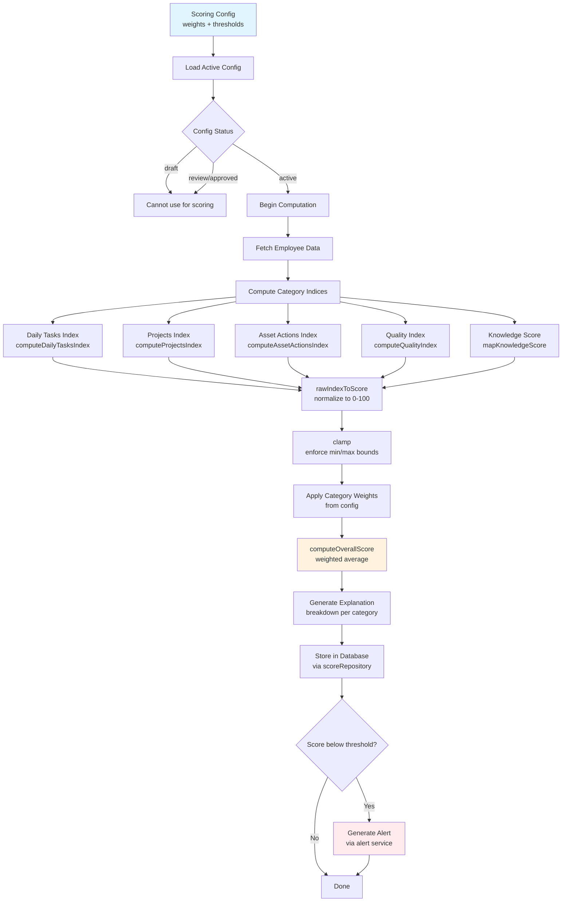
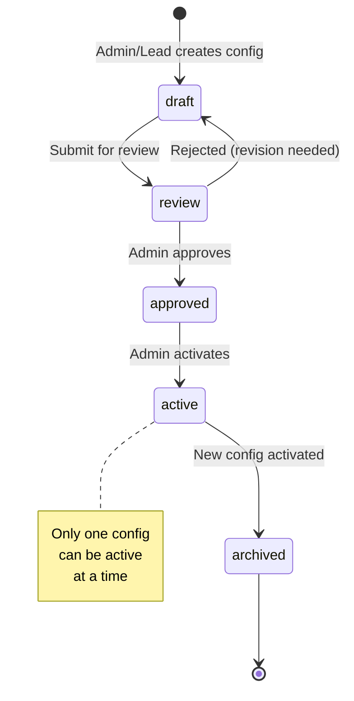

# Score Computation Pipeline

```mermaid
flowchart TD
    A[Scoring Config<br/>weights + thresholds] --> B[Load Active Config]
    B --> C{Config Status}
    C -->|draft| D[Cannot use for scoring]
    C -->|review/approved| D
    C -->|active| E[Begin Computation]

    E --> F[Fetch Employee Data]
    F --> G[Compute Category Indices]

    G --> H[Daily Tasks Index<br/>computeDailyTasksIndex]
    G --> I[Projects Index<br/>computeProjectsIndex]
    G --> J[Asset Actions Index<br/>computeAssetActionsIndex]
    G --> K[Quality Index<br/>computeQualityIndex]
    G --> L[Knowledge Score<br/>mapKnowledgeScore]

    H --> M[rawIndexToScore<br/>normalize to 0-100]
    I --> M
    J --> M
    K --> M
    L --> M

    M --> N[clamp<br/>enforce min/max bounds]
    N --> O[Apply Category Weights<br/>from config]

    O --> P[computeOverallScore<br/>weighted average]

    P --> Q[Generate Explanation<br/>breakdown per category]
    Q --> R[Store in Database<br/>via scoreRepository]

    R --> S{Score below threshold?}
    S -->|Yes| T[Generate Alert<br/>via alert service]
    S -->|No| U[Done]
    T --> U

    style A fill:#e1f5fe
    style P fill:#fff3e0
    style T fill:#ffebee
```

## Config Lifecycle

```mermaid
stateDiagram-v2
    [*] --> draft: Admin/Lead creates config
    draft --> review: Submit for review
    review --> approved: Admin approves
    review --> draft: Rejected (revision needed)
    approved --> active: Admin activates
    active --> archived: New config activated
    archived --> [*]

    note right of active: Only one config<br/>can be active<br/>at a time
```
