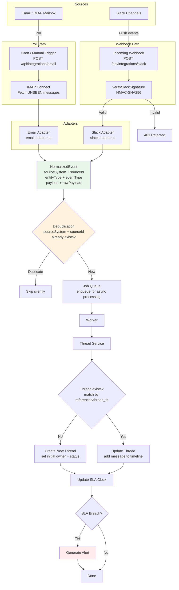
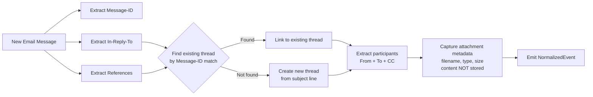
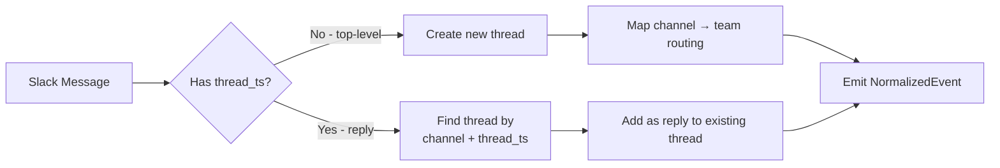

# Thread Ingestion from Email / Slack

```mermaid
flowchart TD
    subgraph Sources
        SL[Slack Channels]
        EM[Email / IMAP Mailbox]
    end

    subgraph Adapters
        SA[Slack Adapter<br/>slack-adapter.ts]
        EA[Email Adapter<br/>email-adapter.ts]
    end

    subgraph Webhook Path
        WH[Incoming Webhook<br/>POST /api/integrations/slack]
        SV[verifySlackSignature<br/>HMAC-SHA256]
    end

    subgraph Poll Path
        CR[Cron / Manual Trigger<br/>POST /api/integrations/email]
        IC[IMAP Connect<br/>Fetch UNSEEN messages]
    end

    SL -->|Push events| WH
    WH --> SV
    SV -->|Valid| SA
    SV -->|Invalid| REJ[401 Rejected]

    EM -->|Poll| CR
    CR --> IC
    IC --> EA

    SA --> NE[NormalizedEvent<br/>sourceSystem + sourceId<br/>entityType + eventType<br/>payload + rawPayload]
    EA --> NE

    NE --> DD{Deduplication<br/>sourceSystem + sourceId<br/>already exists?}
    DD -->|Duplicate| SKIP[Skip silently]
    DD -->|New| JQ[Job Queue<br/>enqueue for async processing]

    JQ --> W[Worker]
    W --> TS[Thread Service]

    TS --> TH{Thread exists?<br/>match by references/thread_ts}
    TH -->|Yes| UM[Update Thread<br/>add message to timeline]
    TH -->|No| CT[Create New Thread<br/>set initial owner + status]

    UM --> SLA[Update SLA Clock]
    CT --> SLA

    SLA --> AC{SLA Breach?}
    AC -->|Yes| AL[Generate Alert]
    AC -->|No| DONE[Done]
    AL --> DONE

    style NE fill:#e8f5e9
    style DD fill:#fff3e0
    style AL fill:#ffebee
```

## Email Threading Logic

```mermaid
flowchart LR
    MSG[New Email Message] --> MID[Extract Message-ID]
    MSG --> IRT[Extract In-Reply-To]
    MSG --> REF[Extract References]

    IRT --> MATCH{Find existing thread<br/>by Message-ID match}
    REF --> MATCH

    MATCH -->|Found| LINK[Link to existing thread]
    MATCH -->|Not found| NEW[Create new thread<br/>from subject line]

    LINK --> PARTS[Extract participants<br/>From + To + CC]
    NEW --> PARTS

    PARTS --> ATT[Capture attachment metadata<br/>filename, type, size<br/>content NOT stored]
    ATT --> NORM[Emit NormalizedEvent]
```

## Slack Threading Logic

```mermaid
flowchart LR
    MSG[Slack Message] --> TS{Has thread_ts?}

    TS -->|Yes - reply| FIND[Find thread by<br/>channel + thread_ts]
    TS -->|No - top-level| NEW[Create new thread]

    FIND --> LINK[Add as reply to existing thread]
    NEW --> CHAN[Map channel → team routing]
    CHAN --> EMIT[Emit NormalizedEvent]
    LINK --> EMIT
```
